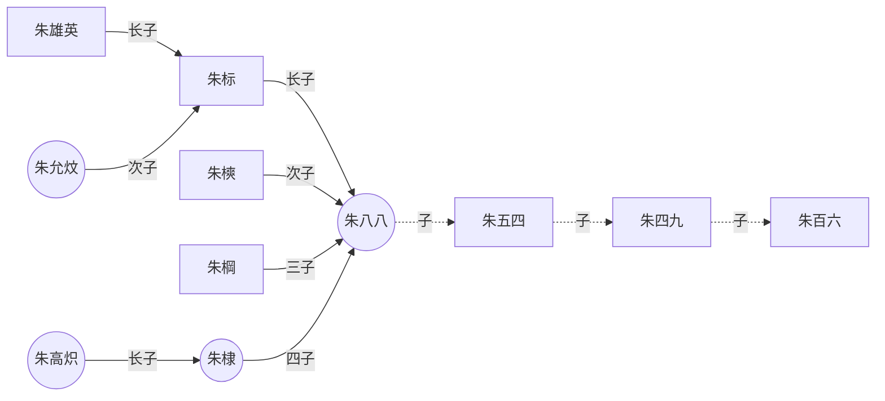

---
{"type":"blog","title":"022-笔记模板2.0---Obsidian适用","tags":["blog/note"],"establish":"2025/02/21","update":null,"dg-publish":true,"permalink":"/Blog/021-关于Obsidian的一些示例/","dgPassFrontmatter":true,"noteIcon":"","created":"2025-02-21T11:01:33.108+08:00","updated":"2025-03-03T20:50:18.499+08:00"}
---


[教程](https://forum-zh.obsidian.md/t/topic/435)

---

|     |     |     |
| --- | --- | --- |
|     |     |     |
|     |     |     |
`这是一段行内代码`

`<table border="1" cellspacing="0" width="500" height="500">`

`print("Hello, World!")`

`这是一行突出显示的文本内容`
<u>sss</u>

<u>这是一段加了下划线的文本</u>

***


***


***

<div style="text-align: left;">

 </div>

***

<div style="text-align: left;">

 </div>
***
<center>
    
    <div style="color:orange; border-bottom: 1px solid #d9d9d9;
    display: inline-block;
    color: #999;
    padding: 2px;"></div>
</center>


***


***


```语言种类
代码内容
代码内容
代码内容
```

下面是HTML代码块

```html
<table border="1">
    <tr>
        <td>row 1, cell 1</td>
        <td>row 1, cell 2</td>
    </tr>
    <tr>
        <td>row 2, cell 1</td>
        <td>row 2, cell 2</td>
    </tr>
</table>
```

下面是CSS代码块

```css
.box {
	width: 600px;
	height: 400px;
	margin: 100px auto;
	background-image: linear-gradient(black 33.3%,red 33.3%, red 66.6%, yellow 66.6%, yellow);
}	
```

下面是JavaScript代码块

```js
// 定义一个30个整数的数组，按顺序分别赋予从2开始的偶数；
//然后按顺序每五个数求出一个平均值，放在另一个数组中并输出。试编程
var arr = [2, 4, 6, 8, 10, 12, 14, 16, 18, 20, 22, 24, 26, 28, 30, 32, 34, 36, 38, 40, 42, 44, 46, 48, 50, 52, 54, 56, 58, 60]
    var newarr = [];
    for (var i = 0, count = 0, sum = 0, len = arr.length; i < len; i++) {
        sum += arr.shift();
        count++;
        if (count % 5 === 0) {
            newarr.push(sum / 5);
            sum =  0;
        }
    }
    console.log(newarr);

    var arr = [2, 4, 6, 8, 10, 12, 14, 16, 18, 20, 22, 24, 26, 28, 30, 32, 34, 36, 38, 40, 42, 44, 46, 48, 50, 52, 54, 56, 58, 60]
    var newarr = [];
    for (var i = 0, len = arr.length; i < len / 5; i++) {
        var subarr = arr.splice(0, 5)
        for (var j = 0, sum = 0; j < subarr.length; j++) {
            sum += subarr[j];
        }
        newarr.push(sum / 5);
    }
    console.log(newarr);
```


下面是Python代码块

```python
#!/usr/bin/python
# -*- coding: UTF-8 -*-

i = 2
while(i < 100):
   j = 2
   while(j <= (i/j)):
      if not(i%j): break
      j = j + 1
   if (j > i/j) : print i, " 是素数"
   i = i + 1
 
print "Good bye!"
```

  

```txt
这是一段
突出显示的
文本内容
```


<!-- 这里是一行注释 -->

<!--
这里是
一段
假装有
很多行的
注释
-->

<audio controls="controls" preload="none" src="https://www.ldoceonline.com/media/english/exaProns/p008-001803372.mp3?version=1.2.30"></audio>

<video width="600" height="420" controls>
  <source src="https://img.codertoro.top/Bucket/img/daily/2023/02/video_20230226%E6%BB%A8%E6%B5%B7%E5%85%AC%E5%9B%AD.mp4"> 
</video>

---

嵌入视频网站
<iframe width=600 height=400 src="http://player.bilibili.com/player.html?aid=20190823&bvid=BV1yW411s7og&cid=32964980&page=1&autoplay=0" scrolling="no" border="0" frameborder="no" framespacing="0" allowfullscreen="true" > </iframe>


***
不自动播放的bilibili
嵌入视频网站
<iframe 
    width="600" 
    height="400" 
    src="http://player.bilibili.com/player.html?aid=20190823&bvid=BV1yW411s7og&cid=32964980&page=1&autoplay=0" 
    scrolling="no" 
    frameborder="0" 
    allowfullscreen="true" 
    title="Bilibili Video Player">
</iframe>


----
嵌入网页
<iframe width=600 height=400 src="https://www.runoob.com/html/html-tutorial.html" scrolling="auto" border="0" frameborder="no" framespacing="0" allowfullscreen="true"> </iframe>


---
流程图



---
![[ 建立博客基本流程.png\|345 ]]


ttt


***
<video style="width: 50%; max-width: 600px; height: auto;" controls playsinline>
  <source src="https://img.codertoro.top/Bucket/img/daily/2023/02/video_20230226%E6%BB%A8%E6%B5%B7%E5%85%AC%E5%9B%AD.mp4">
</video>

***
<video width="50%" height=auto controls>
  <source src="https://img.codertoro.top/Bucket/img/daily/2023/02/video_20230226%E6%BB%A8%E6%B5%B7%E5%85%AC%E5%9B%AD.mp4"> 
</video>
***
<video style="width: 50%; max-width: 600px; height: auto; display: block; margin: auto;" controls playsinline>
  <source src="https://img.codertoro.top/Bucket/img/daily/2023/02/video_20230226%E6%BB%A8%E6%B5%B7%E5%85%AC%E5%9B%AD.mp4">
</video>
***
<div style="position: relative; width: 100%; padding-top: 56.25%;"> <!-- 16:9 比例 -->
  <iframe
    style="position: absolute; top: 0; left: 0; width: 100%; height: 100%;"
    src="http://player.bilibili.com/player.html?aid=20190823&bvid=BV1yW411s7og&cid=32964980&page=1&autoplay=0"
    scrolling="no"
    frameborder="0"
    allowfullscreen="true"
    title="Bilibili Video Player">
  </iframe>
</div>


***
<div style="width: 90%; margin: 0 auto; position: relative; aspect-ratio: 16 / 9; background: black;"> 
<iframe style="position: absolute; top: 0; left: 0; width: 100%; height: 100%; object-fit: contain;" 
src="http://player.bilibili.com/player.html?aid=20190823&bvid=BV1yW411s7og&cid=32964980&page=1&autoplay=0" 
scrolling="no" 
frameborder="0" 
allowfullscreen="true" 
title="Bilibili Video Player"> 
</iframe>
</div>

***
<video style="width: 100%; max-width: 600px; height: auto; display: block; margin: auto;" controls playsinline>
  <source src="http://player.bilibili.com/player.html?aid=20190823&bvid=BV1yW411s7og&cid=32964980&page=1&autoplay=0">
</video>


<iframe width=600 height=400 src="http://player.bilibili.com/player.html?aid=20190823&bvid=BV1yW411s7og&cid=32964980&page=1&autoplay=0" scrolling="no" border="0" frameborder="no" framespacing="0" allowfullscreen="true" > </iframe>

|     |     |
| --- | --- |
|     |     |

|     |     |
| --- | --- |
|     |     |
|     |     |


|     | 哈哈哈  |     |     |
| :-- | :--: | :-- | :-- |
|     | 收拾收拾 |     |     |
|     |      |     |     |
|     |      |     |     |
Obsidian 外观CSS，一次退烧 V2.0
AnuPpuccin 主题重新上架Obsidian主题市场！
CSS片段更新：全宽表格、文档自然嵌入、Live Preview空白行优化2.0.
css 文件下载：https://fgt279p8ue.feishu.cn/docx/KKmEd9skqo2omkxScflcmpEYnjc?from=from_copylink

```
ahh
```
```
sss
```


| aaaa | ddd |     |     |
| :--: | :-: | :-: | :-: |
|  aa  | aa  | aa  | aa  |
|  aa  |     |     |     |
|      |     |     |     |

***


